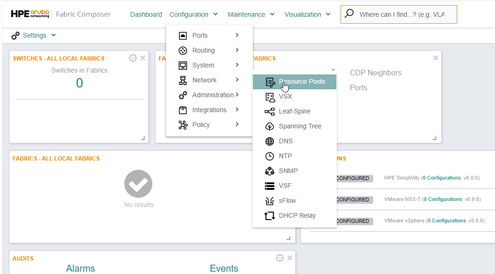
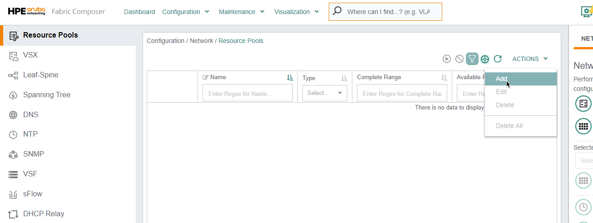
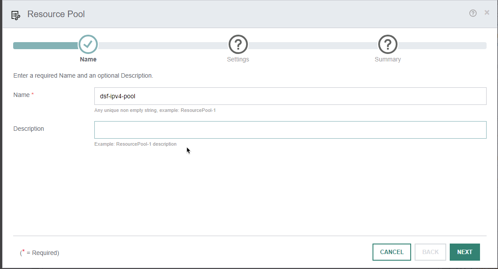
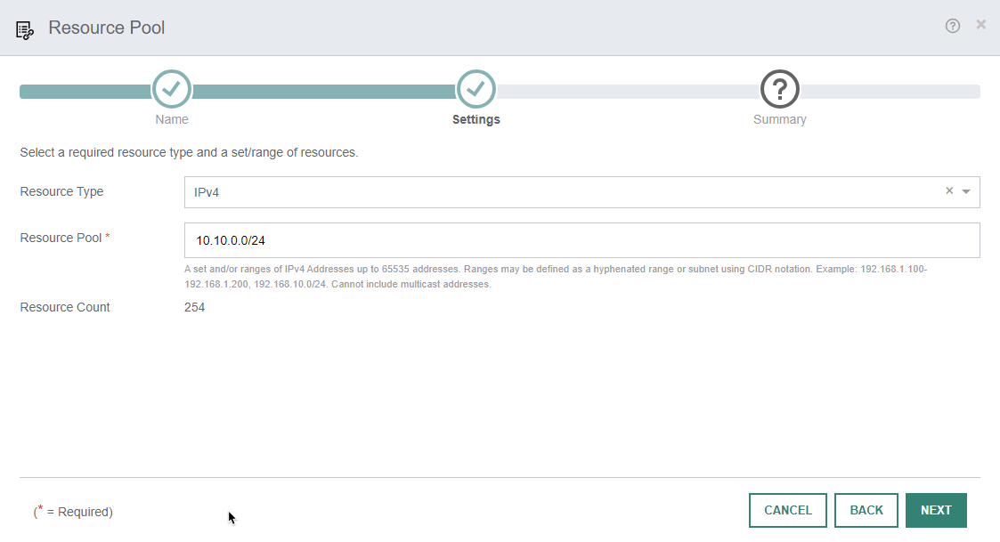
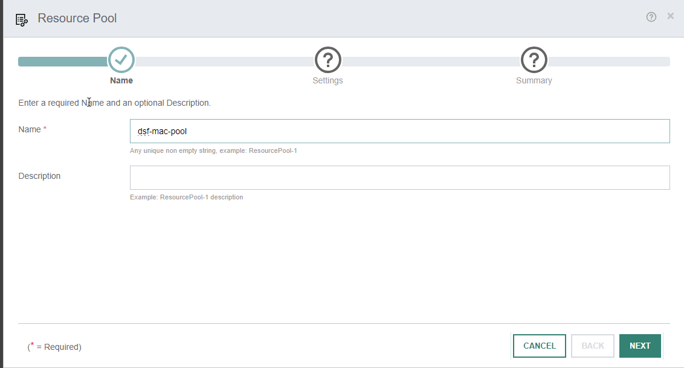

# Lab 2 - Create Network Resource Pools

## Lab Overview

Lab time:  20 minutes

The HPE Aruba Fabric Composer uses network resource pools. In this lab you will create an IP and MAC Address Pool.

## Lab 2.1 - Create IP Addrees Pool

### Description
When creating VSX pairs, OSPF or BGP routing, the AFC needs resource pools for IP and MAC addresses. You will cereate these resource pools now so they are available throughout this lab.

### Validate  
1. Navigate with the **Configuration / Network / Resource Pools** select **Actions**, and click on **Resource Pools**

  
_Fig. Lab 2 Navigate_  

2. Click **Actions** and select **Add**.
  
  
_Fig. Lab 2 Actions/Add_  

3. In the **Name** context, enter **dsf-ipv4-pool**, then in the **Description** enter **IPv4 Address Pool**

  
_Fig. Lab 2 IPv4 Name_ 

|   |   |  
|---|---|
| **Step 1 - Name** | |
| Name | ``dsf-ipv4-pool`` |  
| Desctiption | ``IPv4 Address Pool`` |  
 
| **Click NEXT**  |

4. In the **Resource Pool** enter **10.10.0.0/24**

  
_Fig. Lab 2 IPv4 Name_ 

|   |   |  
|---|---|
| **Step 2 - Settings** | |
| Resource Type | ``IPv4`` |  
| Resource Pool | ``10.10.0.0/24`` |  
| **Click NEXT** | |  
| Review the Summary and **APPLY** | |  

### Expected Results

1. Verify the new IPv4 Pool has been created. See the image below. Now **from the same screen** click on the **Actions/Add** menu.

  
_Fig. Lab 2 New IPv4 Resource Pool_  

2. The workflow for adding the resource pool appears. This time you will create a MAC pool. Enter the name and description. 

  
_Fig. Lab 2 Name MAC Resource Pool_  

|   |   |  
|---|---|  
| Name | ``dsf-mac-pool``|
| Description | ``MAC Address Pool`` | 

| **Click NEXT**  |

3. Enter the settings for the MAC address pool. **Pull Down** the **Resource Type** and select **MAC Address**. Enter the MAC Address range in the Resource Pool.

  
_Fig. Lab 2 Settings MAC Resource Pool_  

|   |   |  
|---|---|  
| Resource Type | ``MAC Address``|
| Description | ``02:00:00:00:00:aa-02:00:00:00:00:ff`` | 

| **Click NEXT**  |

| Review the Summary and **Click APPLY** | |  
  

### Expected Results  
On the display should be a list of bother address pools.

  
_Fig. Lab 2 Both Resource Pools_ 

## Lab 2 Summary  
- We added a IPv4 Resource pool with **10.10.0.0/24**.
- We We added a MAC pool with **02:00:00:00:00:aa-02:00:00:00:00:ff**
- We verified that both pools have been created.

