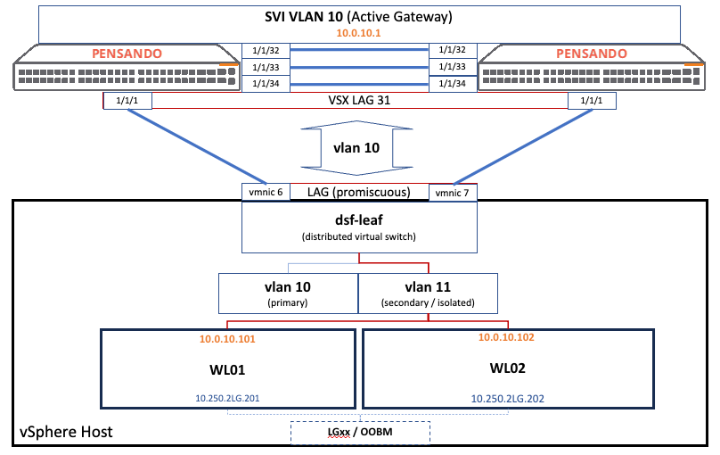
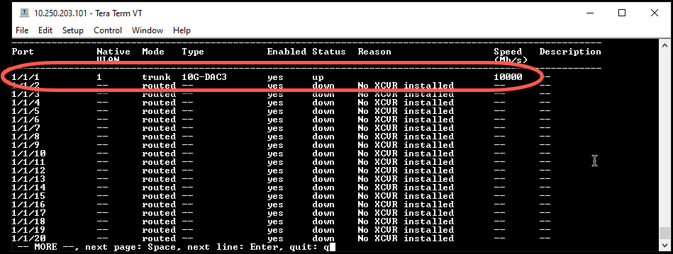
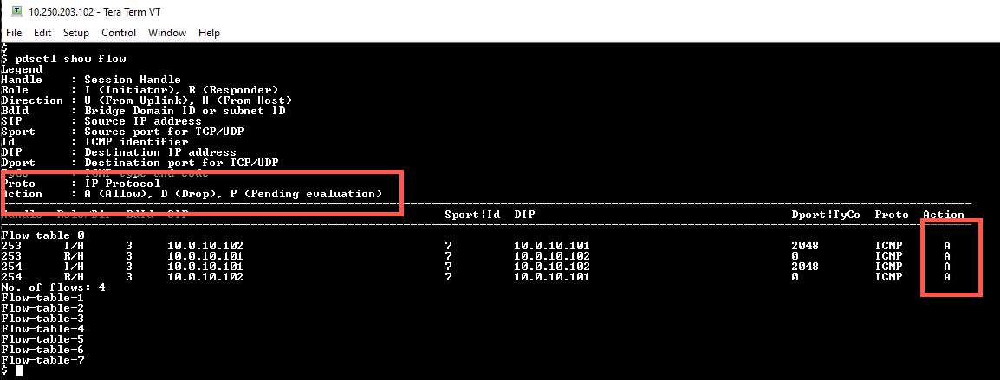
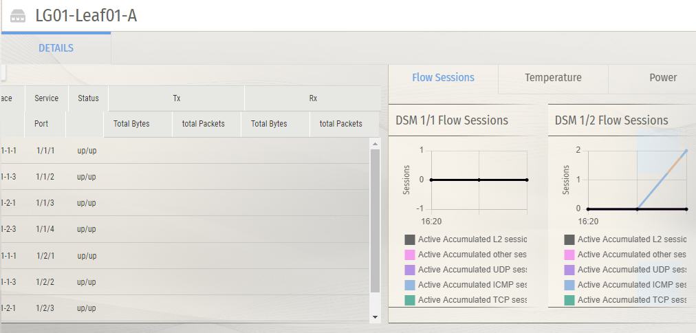
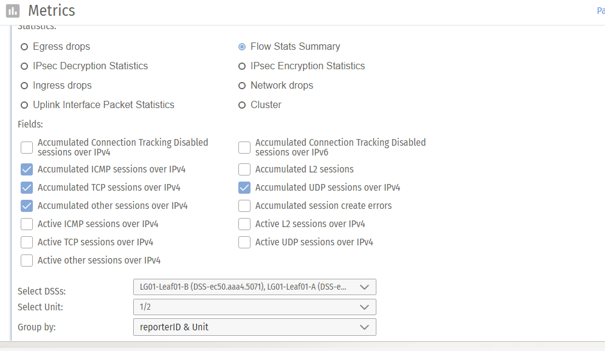
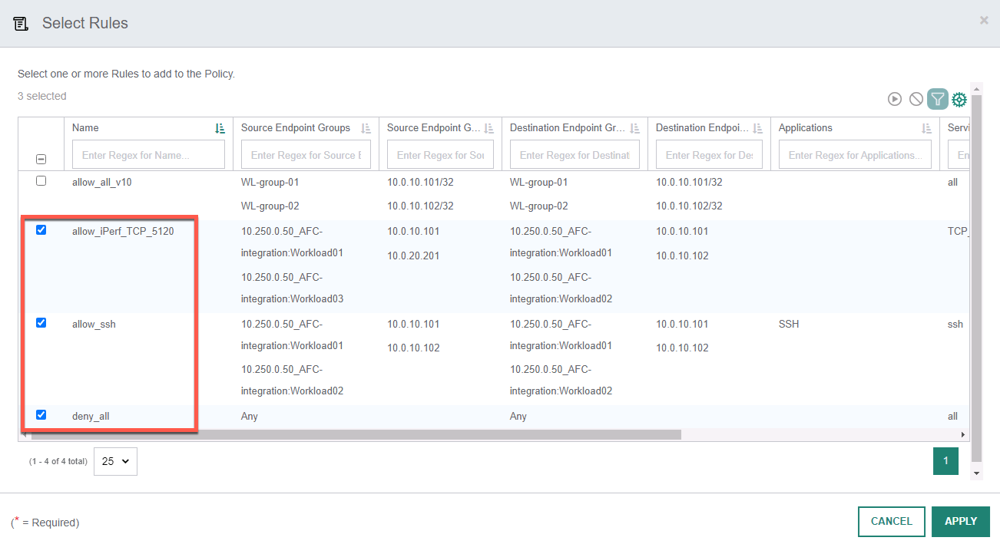
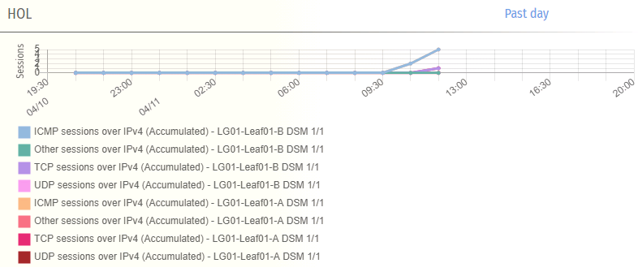

# Lab 6 - Visibility and Troubleshooting

## Lab Overview

Lab time:  30 minutes

On top of the stateful services and microsegmentation, the CX 10000 also delivers visibility into each and every East / West flow.  During this lab, we will test some basic traffic flows (ping, SSH, iPerf3), the firewalling policies and also explore the power of having complete visibility.

## Lab 6.1 - Add SVI to VLAN 10

### Description
In order to successfully redirect packets over the switch, we need to create a correspondng Switched Virtual Interface (SVI) for VLAN 10 to the switch.

### Validate  
1. In Fabric Composer, using the top menu, navigate to **Configuration / Routing** and then select **VRF**.  

2. Click the 3 dots left of **default** and select **IP Interfaces**.  

  
_Fig. Lab 6 IP Interfaces_  

3. In the **IP Interfaces** context, select **Actions**, then **Add** and enter the following information in the form  

|   |   |  
|---|---|
| **Step 1 - Interfaces Type** | |
| Enable this IP interface | Yes (select) |  
| Type | SVI |  
| VLAN | 10 |  
| Switches | Select the VSX pair (``dsf_LG01-Leaf01-A_LG01-Leaf...``) |  
| IP Subnet Address | ``10.0.10.0/24`` |  
| IPv4 Addresses | ``10.0.10.2-10.0.10.6`` |  
| Active Gateway IP Address | ``10.0.10.1`` |  
| Active Gateway MAC Address | ``02:00:00:00:00:01`` |  
| Enable VSX Shutdown on Split | Yes |  
| Enable Local Proxy ARP | Yes |  
| **Click NEXT** | |  

|   |   |  
|---|---|
| **Step 2 - Name** | |
| Name | ``SVI10`` |  
| Description | (optional) |  
| **Click NEXT** | |  
| Review the Summary and **APPLY** | |  

### Expected Results

1. Verify the new SVI in the AFC  

  
_Fig. Lab 6 New SVI_  

2. Now let's ensure that the Network was added to the PSM by logging into the PSM:  

|   |   |  
|---|---|  
| URL | 10.250.2**LG**.31 (LG = Labgroup Number)|
| Username | ``admin`` |  
| Password | ``Pensando0$`` |  

3. Go to **Tenants / Networks**  and you should see VLAN10 listed in your networks

  
_Fig. Lab 6 PSM Networks_  


## Lab 6.2 - Test Policies and SVI

### Description
In the previous activity, you created a policy with a single ``allow_all`` rule, to allow all traffic between ``Workload01`` and ``Workload02``.  

### Validate
To test the rule and visualize the flows, follow the following steps:  

1. Using Putty or TeraTerm, open an SSH session with each workload  

| Workload | Address for SSH* | Username | Password | Hostname | VLAN 10 Address | 
|---|---|---|---|---|---|
| 1 | 10.250.2**LG**.201 | ``arubatm`` | ``admin`` | lg**LG**-wl01 | 10.0.10.101 |
| 2 | 10.250.2**LG**.202 | ``arubatm`` | ``admin`` | lg**LG**-wl01 | 10.0.10.102 |  

2. From each workload, ping the VLAN 10 SVI 10.0.10.1 to verify connectivity between the VMs and the switches.  

  
_Fig. Lab 6 Ping SVI_  

### Expected Results

Now have a look at the following network diagram to understand the flow.  Both WL01 and WL2 have 10.0.10.xxx IP Addresses and the Primary VLAN (VLAN 10) is paired with an Isolated VLAN (VLAN 11).  The traffic on VLAN 11 is re-routed to the DSM chip on the CX10K for processing via the primary VLAN 10.  

  
_Fig. Lab 6 SVI Diagram_  

Policies will be defined using the AFC and sent, via automation, to the Pensando PSM. In turn, the PSM will program the enforcement on the DSM chips. A workload aware infrastructure built on top of a fully programmable, Automated, Scalable network pipeline.  

```{note}
If you cannot ping the gateway, check to see that the switch ports are up!  Enable port with no shut command.
```  

  
_Fig. Lab 6 Switch Port Up_  


## Lab 6.3 - View Flow Logs

### Description  
Now that we have traffic on VLAN 10 being redirected over the DSM, we can start to look at some of the telemetry.  During this lab, we will generate traffic betweeen two VMs on the same ESXi host, and will view the live flow logs.

### Validate  

1. Using the SSH sessions to Workload01 and Workload02 from the previous exercise, initiate a new continuous ping and do not interrupt it:
  - From ``Workload01``, ping ``10.0.10.102``  
  - From ``Workload02``, ping ``10.0.10.101``  

2. Open two new SSH sessions, to each CX 10000 Switch:

|Switch|Address for SSH|Username|Password|
|---|---|---|---|
| 1 | 10.250.2**LG**.101 | ``admin`` | ``admin`` |  
| 2 | 10.250.2**LG**.102 | ``admin`` | ``admin`` |  

3. On one of the switches, find which VLANs are being redirected to the DSM (Distributed Services Module = the Pensando Elba Packet Processor) for policy enforcement  

```{note}
The CX 10000 Switch has two DSMs, and redirected VLANs are distributed between them using a hashing algorithm.  In a CX 10000 VSX pair, all redirection and flow policing is synchronized across both switches
```  

4. On each switch, run the following command and you should see an output similar to the screenshot below:  

```show dsm redirect```  

  
_Fig. Lab 6 Show DSM Redirect_  

```{note}
In this example, VLAN 10 is redirected to DSM 1/1 on both switches, however in your lab, you may see redirection to DSM 1/2  
```  

5. To visualize the flows, enter diagnostics mode on the switch by entering the following commands:  

  - ``diagnostics``  
  - ``diag dsm console 1/1`` (ensure you specify the DSM from the command above)  
  - ``pdsctl show flow``  

### Expected Results  

After running the command ``pdsctl show flow``, you should a table showing the two flows, in each direction.  

  
_Fig. Lab 6 pdsctl show flow_  

```{note}
Notice that the action is A (allow) for all 4 flows  
```  

## Lab 6.4 - Analyze Flow Graphs

### Description  
The Switches forward flow data to the PSM and using the PSM, you can create different visualizations and dashboards based on that data.  During this exercise, we will create some flow graphs to do just that.

### Validate  

1. In the PSM browser tab, goto **Sytem / DSS** and then click on the _first DSS-ID_  

  
_Fig. Lab 6 DSS Overview_  

2. Scroll down and look to the bottom right to see the graphs.

  
_Fig. Lab 6 Flow Graphs_  

3. Go to **Monitoring / Metrics** and select **CREATE CHART** (top right)  

4. Create a chart using the following paramters and save it.  For the ***Select DSSs*** drop down, choose the ***both switches***.  _Make sure to select the DPU you saw from the PDSCTL command you ran earlier_ (should be either 1/1 or 1/2).  Once completed, click **Save Chart**  

  
_Fig. Create Chart_  

### Expected Results  
Since we should still have ping running between the workloads, we should see a graph similar to the following screenshot.  You can use this reporting function from the PSM to visualize all traffic passing through the DSM chips.  

  
_Fig. New Flow Chart_  

## Lab 6.5 - Add Policy Rules

### Description  
During this exercise, we will use the AFC to modify the policy that we created in an earlier step, and add the following rules between Workload01 and Workload02:

- Allow SSH  
- Allow iPerf3 client/server flows (default using TCP port 5201) with the server on Workload02  
- Deny All (block everything else, including ping)  

### Validate  

1. Using the browser, navigate back to the Fabric Composer  

2. Go to **Configuration / Policy / Rules**  

3. Create the first ``allow_ssh`` Rule using the following settings:  

|   |   |
|---|---|
| **Step 1 - Name** | |  
| Name | ``allow_ssh`` |  
| Description | (optional) |  
| **Click NEXT** | |

|   |   |
|---|---|
| **Step 2 - Settings** | |  
| Type | Layer 3 |  
| Action | Allow |  
| **Click NEXT** | |

|   |   |
|---|---|
| **Step 3 - Endpoint Groups** | |  
| Source Endpoint Groups | _Select both Workload Groups_ |  
| Destination Endpoint Groups | _Select both Workload Groups_ |  
| **Click NEXT** | |

|   |   |
|---|---|
| **Step 4 - Application and Service Qualifiers** | |  
| Applications | SSH |  
| Service Qualifiers | (leave empty) |  
| **Click NEXT** | |
| Review the Summary and **Click APPLY** | |  

4. Create the second ``allow_iPerf_TCP_5201`` Rule using the following settings:  

|   |   |
|---|---|
| **Step 1 - Name** | |  
| Name | ``allow_iPerf_TCP_5201`` |  
| Description | (optional) |  
| **Click NEXT** | |

|   |   |
|---|---|
| **Step 2 - Settings** | |  
| Type | Layer 3 |  
| Action | Allow |  
| **Click NEXT** | |

|   |   |
|---|---|
| **Step 3 - Endpoint Groups** | |  
| Source Endpoint Groups | _Select both Workload Groups_ |  
| Destination Endpoint Groups | _Select both Workload Groups_ |  
| **Click NEXT** | |

|   |   |
|---|---|
| **Step 4 - Application and Service Qualifiers** | |  
| ***Leave the Application box emtpy and click ADD at the bottom*** | |

|   |   |   |
|---|---|---|  
| | **Sub-step A - Name** | |  
| | Name | TCP_5201 |  
| | Description | (optional) |  
| | **Click NEXT** | |

|   |   |   |
|---|---|---|  
| | **Sub-step B - Settings** | |  
| | IP Protocol | ``tcp`` |  
| | Source Port | any |  
| | Destination Port | ``5201`` |  
| | Click **ADD** (bottom left), **NEXT**, review the Summary and **APPLY** | |  


5. Create the third ``deny_all`` rule using the following settings:  

```{note}  
There is an implicit deny all rule at the end of any policy, so this step is optional
```

|   |   |
|---|---|
| **Step 1 - Name** | |  
| Name | ``deny_all`` |  
| Description | (optional) |  
| **Click NEXT** | |

|   |   |
|---|---|
| **Step 2 - Settings** | |  
| Type | Layer 3 |  
| Action | Drop |  
| **Click NEXT** | |

|   |   |
|---|---|
| **Step 3 - Endpoint Groups** | |  
| Source Endpoint Groups | (leave empty) |  
| Destination Endpoint Groups | (leave empty) |  
| **Click NEXT** | |

|   |   |
|---|---|
| **Step 4 - Application and Service Qualifiers** | |  
| Applications | (leave empty) |  
| Service Qualifiers | (leave empty) |  
| **Click NEXT** | |
| Review the Summary and **Click APPLY** | |  

6. Go to **Policies**, find the **dsf-leafLG-01** policy, and click the **3 dots** to add/modify the rules  

7. Select the ``allow_all`` rule and under **ACTIONS**, click **Remove**  

8. Click the **ACTIONS** menu again, and now select **ADD > Existing** in order to add the rules from the previous step, to this policy  

9. Select the new rules and click **APPLY**  

  
_Fig. Add Rules_  

```{note}
Ensure the deny_all rule is the last rule in the policy - this will create a default deny scenario.  If the deny all rule is not the last rule, you can change the order by editing the policy.
```

### Expected Results  

Our Firewall Policy should now have a zero trust type of behavior, where all East/West traffic on VLAN 10 is dropped, with the exception of SSH between two workloads, and iPerf.  

## Lab 6.6 - Test Policy Rules  

### Description  
In the previous activity you created new rules for traffic between Workload011 and Workload02, as well as a deny_all rule.  Now we will test the behavior of these new rules.  Our pings between Workload01 and Workload02 should still be running in the background as well.  

### Validate  
1. Go back to the SSH session from one of your switches and rerun the command:  ``pdsctl show flow``  

```{note}
In the flow table, notice that now the Action is D (deny) for all 4 flows.
```  

2. Return to the SSH sessions of each workload and stop the ping.  Restart the ping and according to the new ruleset, the ping should be blocked.  

3. To test SSH on Workload01, run the following command using the credentials ``arubatm`` / ``admin``:

- ``ssh 10.0.10.102``  

4. Return to the SSH session of one of your switches.  Enter the DSM diagnostics mode (similar to a previous exercise) by running:  

- ``diagnostics``  
- ``diag dsm console 1/x``  (ensure you enter the diagnostics of the DSM which VLAN 10 is redirected to)  
- ``pdsctl show flow``

  
_Fig. Show Flow SSH_  

```{note}
Notice that the action for the flow to and from port 22 (SSH) is A (Allow)
```  

5. Open the PSM browser tab and refresh the Metrics page.  You should see a graph similar to the following screenshot.  

  
_Fig. Graph SSH_  

### Expected Results  
During this lab we tested the firewall policies that we created from the previous exercise.  Ping should now be blocked on VLAN 10, however SSH between our two Workload VMs should still be allowed.  The graphs and flow data available in PSM allows us to view all of the allowed and denied traffic patterns.  


## Lab 6.7 - Testing iPerf  

### Description  
Other than SSH, we also added a rule to test iPerf which is a network performance testing tool.  We will configure Workload02 as the iPerf3 server, and Workload01 as the iPerf3 client.  

### Validate  
1. Go back to your SSH session on ``Workload02`` and run the following command in order to start the **iPerf3 server**:  ``iperf3 -s``  

  
_Fig. iPerf Server_  

2. Go back to the ``Workload01`` SSH session, and log out of SSH session from **Workload01** to **Workload02** _(if still active)_  

3. On ``Workload01``, start the iPerf3 client using this command:  ``iperf3 -c 10.0.10.102 -t 1000``

  
_Fig. iPerf Client_  

4. Now let's look at the flow table on one of the switches again.  On one of the switches, rerun the command: ``pdctl show flow``  

  
_Fig. iPerf Flow Logs_  

5. Go to the PSM UI and refresh the Metrics page one more time.  You should see some updated graphs like the following.  

  
_Fig. iPerf Graph_  

### Expected Results  
Just like in the previous lab, we should have the behavior that all traffic in VLAN 10 is denied, with the exception of SSH and iPerf.  This lab should have confirmed this behavior.

## Lab 6.8 - Unique Flows  

### Description  
Enabling stateful services or microsegmentation in a brownfield environment, where little to no enforcement is d, is not an easy task.  This is where some of the built in metrics to the CX 10000 help.  We will look at how to find analyze unique flows on a given network.  

### Validate  
1. In the PSM UI, navigate to **Tenant / Security Policies**  

2. Click the **Table View** menu from the top right corner, and select **Network Graph**  

  
_Fig. Network Graph Menu_  

3. Under the Security Policies filter, select the **default** VRF  

  
_Fig. Security Policies Filter_  

4. Wait for the data to load and analyze the Unique Flows table on the right hand side.  

### Expected Results  

Using the Unique Flows function from the PSM, we are able to see all of our unique flows on VLAN, over a specified time period.  Having this level of data is crucial for implementing stateful services on your network.  


## Lab 6 Summary  
- We added a Switched Virtual Interface to the switch for VLAN 10
- We verified that the traffic for VLAN 10 is successfully redirected over the AMD DSM, and become stateful  
- We analyzed the DSM flow tables to see allowed or denied traffic  
- We set up a zero trust and microsegmentation policy for VLAN 10, where all traffic is denied, with the exception of iPerf and SSH between two workloads
- We verified that the firewall policies that we defined for VLAN 10 are enforced
  - SSH (tcp 22) between Workload01 and Workload02 is open
  - iPerf3 (tcp 5201) between Workload01 and Workload02 is open  
  - All other traffic patterns are denied - we verified this by attempting a ping from one workload to the other  

